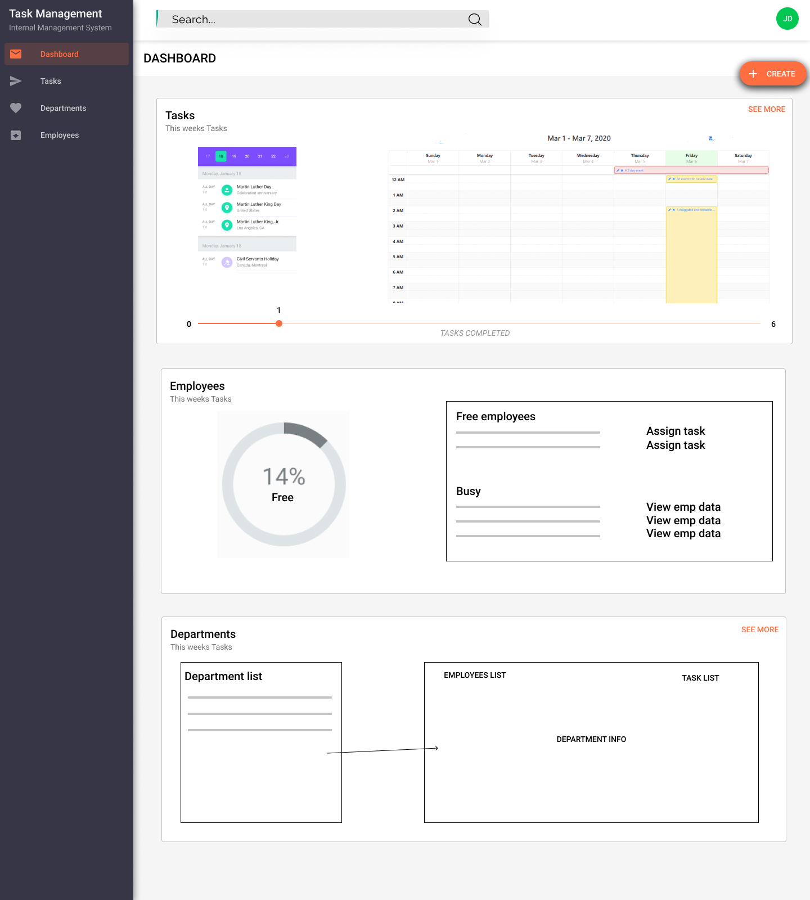
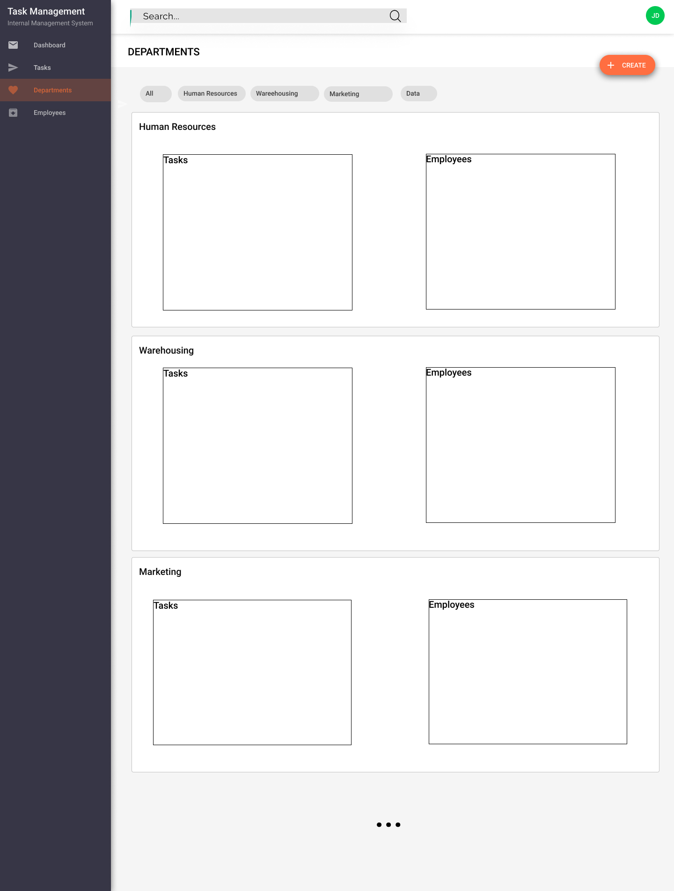
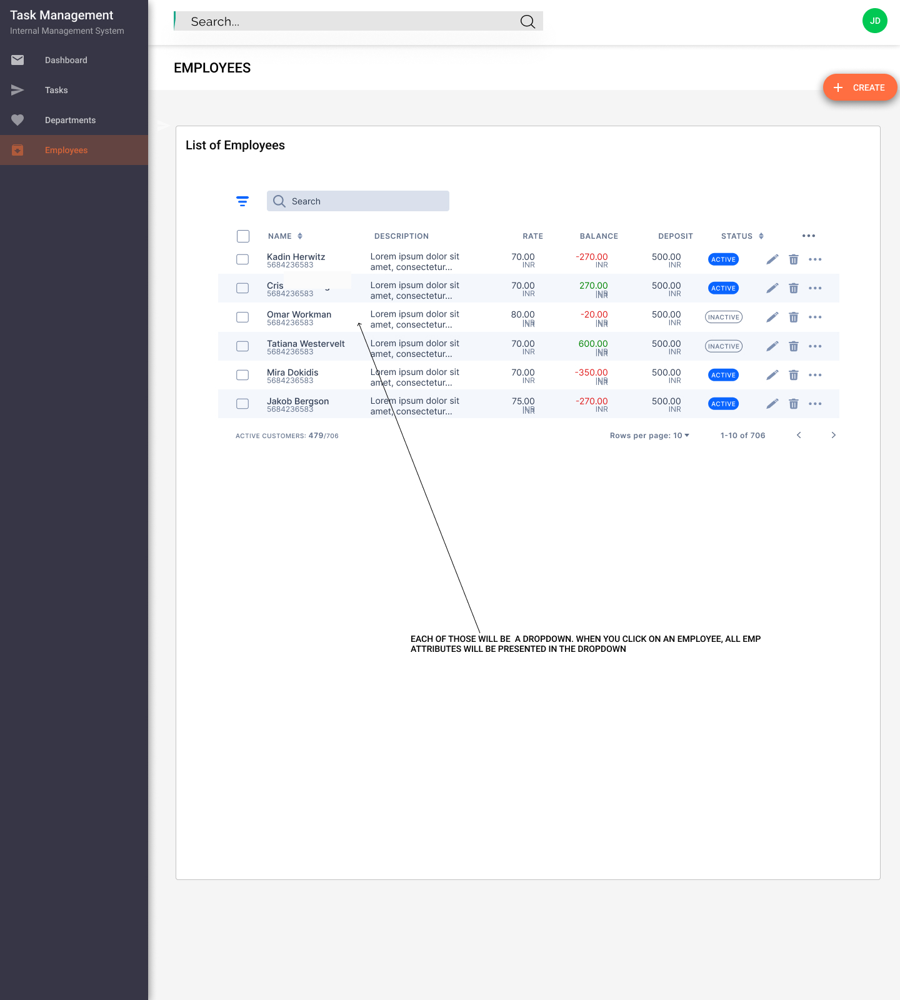
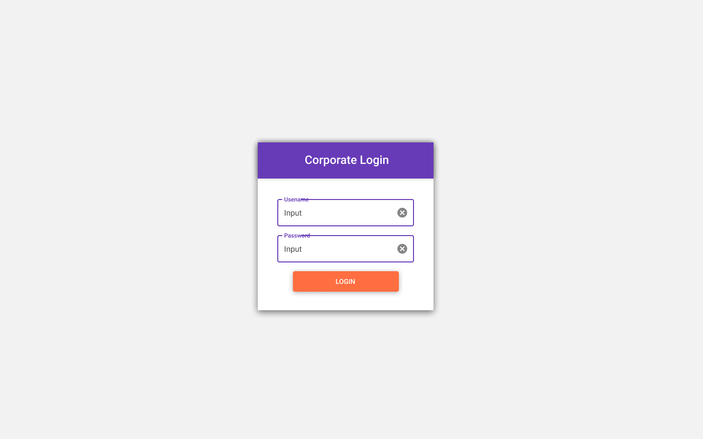
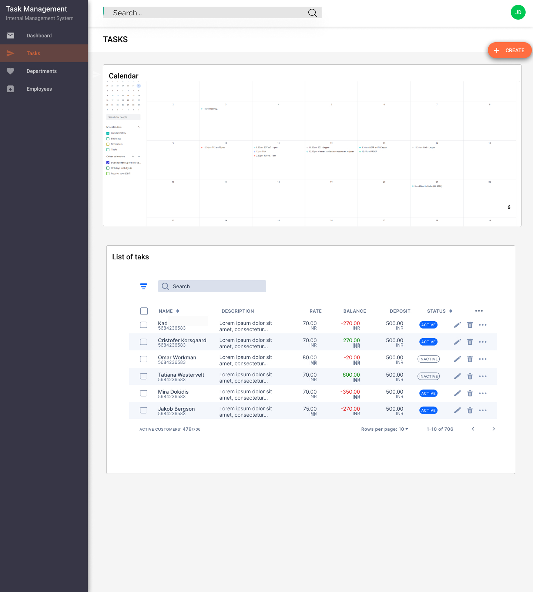
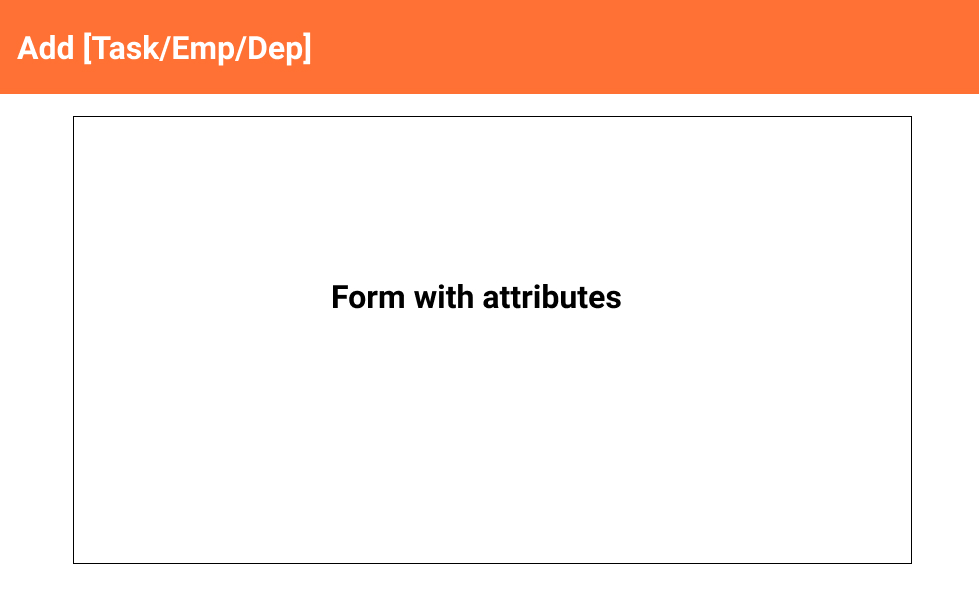

# WEB_2_Dimitar_Aleksandra_Deyna

### Link: [http://i380048.hera.fhict.nl/Web2/WEB2-Deyna-Dimitar-Aleksandra/]

### Project Description

The goal of the project is to create an internal Task Management system for a fictitious client. The project is part of Web_2 university course

## Design

### Prototype

[https://www.figma.com/proto/dpHTdU4gDWlZ5RXPoZAPXZ/WEB_2_Department_Management](https://www.figma.com/proto/dpHTdU4gDWlZ5RXPoZAPXZ/WEB_2_Department_Management?node-id=4%3A42&scaling=min-zoom)

#### Mock-ups (From protoype)

### Technologies

- Angular 8
